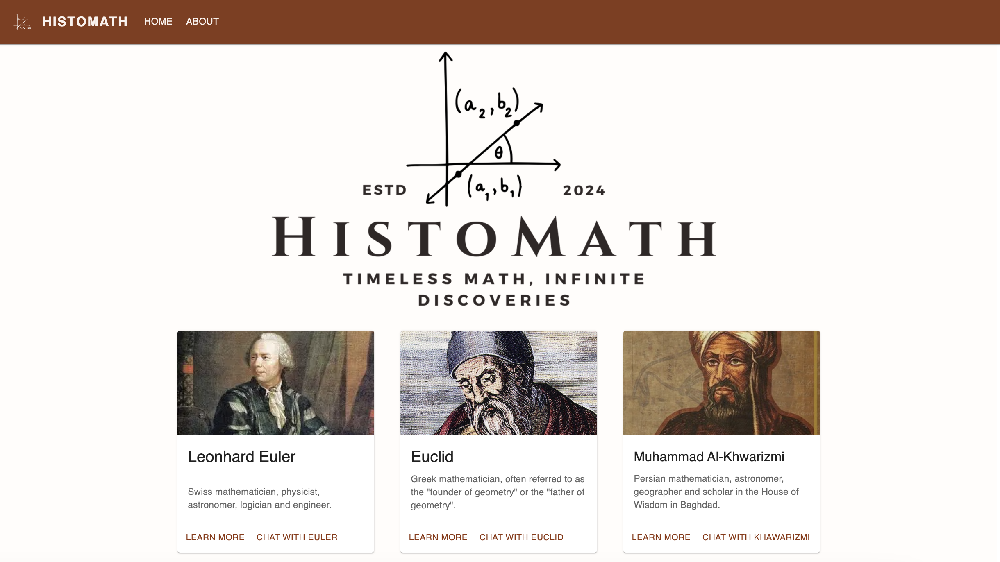
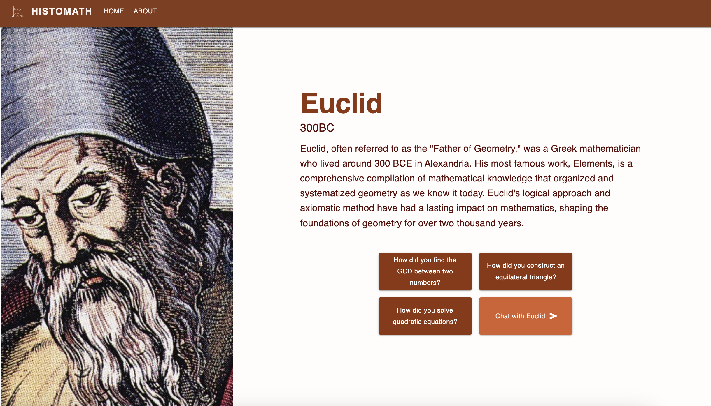

<h1 align="left">Histomath: Timeless Math, Infinite Discoveries</h1>

###

<h3 align="left">What is Histomath?</h3>

###

Histomath is an innovative chatbot application that brings historical mathematicians to life, allowing users to engage with them and explore their insights, discoveries, and problem-solving methods. Through Histomath, users can interact with renowned mathematicians and inquire about their findings, approaches to mathematical challenges, and how they would solve problems within the context of their time periods. This unique platform highlights the evolution of mathematical concepts, showcasing how approaches and solutions can vary across different historical eras.

###

<h3 align="left">Technologies Used</h3>

###

  
  
  
  
  
  
  

###

1. JavaScript 2. React 3. MongoDB 4. NodeJS 5. OpenAI API

###

<h3 align="left">Site Preview</h3>

###

